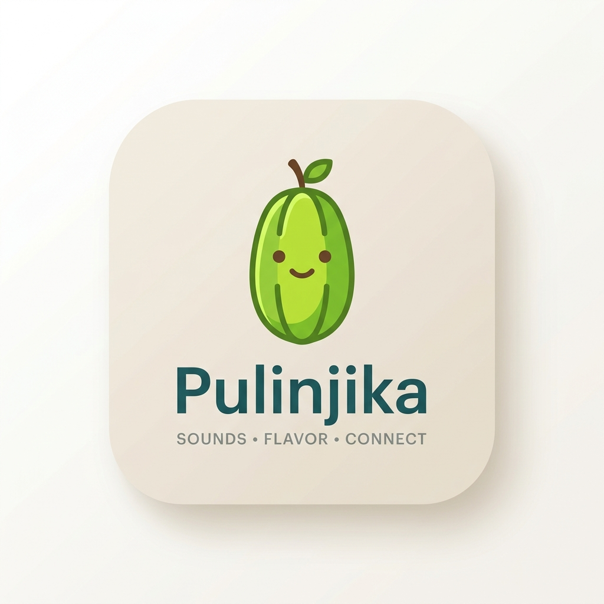

# 🎙️ Pulinjika - Real-time Audio Social

**Pulinjika** is a high-performance, real-time audio social platform designed for seamless group conversations. Built with a focus on stability, moderation, and premium user experience, it allows users to drop into rooms, raise hands, and engage in meaningful live audio discussions.



## ✨ Core Features

-   **🛡️ Production-Grade Stability**: 
    -   **Persistent Sessions**: Stay logged in and keep your role even after page refreshes.
    -   **Self-Healing Rooms**: Rooms and passkeys are preserved across server restarts (up to 24 hours).
    -   **Graceful Reloads**: A 5-second disconnect buffer prevents users from "flickering" out of the room during refreshes.
-   **👑 Advanced Moderation**:
    -   **Role Management**: Hosts can promote listeners to the stage or demote speakers back to the audience.
    -   **Full Control**: Admins can force-mute speakers or kick unruly participants from the room.
    -   **Stage Notifications**: Real-time hand-raise queue for hosts to manage speaker requests.
-   **💬 Social Engagement**:
    -   **Real-time Reactions**: Send '👍' and '❤️' reactions that float dynamically over avatars.
    -   **Hand-Raising**: Listeners can signal their desire to speak with a single tap.
-   **📱 Premium Mobile-First Design**:
    -   **Skeuomorphic UI**: Clean, neo-brutalist inspired design with soft shadows and interactive depth.
    -   **Native Experience**: Bottom-sheet style modals and optimized touch targets for a native app feel on mobile.

## 🚀 Tech Stack

-   **Frontend**: Vanilla HTML5, CSS3 (Custom Design System), JavaScript (ES6).
-   **Backend**: Node.js, Express.
-   **Real-time Signaling**: Socket.io.
-   **Audio Engine**: Agora RTC Web SDK.
-   **Persistence**: File-based JSON storage with client-side "Self-Healing" reconciliation.

## 🛠️ Setup & Installation

1.  **Clone the repository**:
    ```bash
    git clone https://github.com/HellzAngel/pulinjika.git
    cd pulinjika
    ```

2.  **Install dependencies**:
    ```bash
    npm install
    ```

3.  **Environment Variables**:
    Create a `.env` file in the root directory (optional for local dev):
    ```env
    PORT=3000
    ```

4.  **Run the application**:
    ```bash
    npm start
    ```
    The app will be available at `http://localhost:3000`.

## 📱 Mobile App (Android)

Pulinjika is built with **Capacitor**, allowing you to generate a native Android application from the same codebase.

### Build Instructions:
1.  **Open in Android Studio**:
    ```bash
    npx cap open android
    ```
2.  **Syncing Changes**: If you make changes to your web code in `public/`, run this to update the Android project:
    ```bash
    npx cap sync
    ```
3.  **Permissions**: The app is pre-configured with:
    -   `RECORD_AUDIO` (For speaking on stage)
    -   `INTERNET` (For real-time signaling)
    -   `MODIFY_AUDIO_SETTINGS` (For optimized audio output)

## 🌐 Deployment

-   **Backend**: Optimized for deployment on **Render** (handles ephemeral disk restarts automatically).
-   **Frontend**: Compatible with **Vercel**, **Netlify**, or any static hosting service.

## 📄 License

This project is open-source and available under the [MIT License](LICENSE).

---
Developed with ❤️ by the Pulinjika Team.
